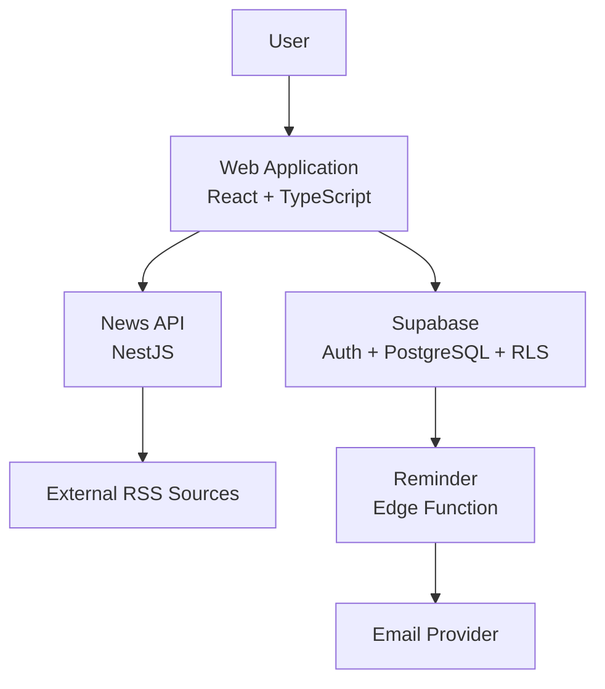

<p align="center">
  
</p>

**EpiCentro** is a web platform that brings together epidemiological news monitoring, personal vaccination tracking, dose reminders, and short educational challenges.

The project was designed to transform fragmented public health information into a centralized and approachable experience where users can stay informed, review upcoming vaccine doses, and reinforce epidemiology concepts.

> [!NOTE]
> This repository is a public portfolio case study. The source code, data, infrastructure, internal documentation, and brand assets remain in private repositories because the original software was developed for a client.

---

## Overview

EpiCentro combines three main areas of prevention:

- **Early awareness** through an interactive epidemiological news map.
- **Personal prevention** through a digital vaccination record and dose reminders.
- **Accessible education** through daily epidemiology-themed games.

The system includes a modular React frontend, a NestJS news-processing API, and a Supabase data layer with authentication, PostgreSQL, Row Level Security, and Edge Functions.

> [!IMPORTANT]
> EpiCentro displays relative news activity. It does not calculate clinical incidence, diagnose disease, or issue official outbreak declarations.

---

## Project Pitch

<p align="center">
  <a href="https://drive.google.com/file/d/1sdn0lJUc-XRMm08DtYMnmaqi2kukJJDi/preview">
    
  </a>
</p>

<p align="center">
  Open the external video to see EpiCentro's interface and main user flows.
</p>

> [!NOTE]
> The video is hosted on Google Drive and opens in a separate viewer. Public access depends on the sharing permissions configured for the file.

---

## Project Goals

The project was created to:

- Centralize epidemiological information and vaccination tools.
- Present recent health-related news through an interactive map of Mexico.
- Help users organize their vaccine history and upcoming doses.
- Provide timely in-app and email-ready reminders.
- Explain epidemiology concepts through short daily challenges.
- Protect personal information through database-level access policies.
- Maintain a modular architecture that can evolve by feature.

---

## Core Modules

| Module | Main Capabilities | Status |
|---|---|---|
| Epidemiological Map | Interactive map of Mexico, relative activity by state, disease filters, activity-level filters, and related news | Implemented |
| News Processing | RSS ingestion, normalization, deduplication, keyword detection, relevance scoring, caching, and scheduled updates | Implemented |
| Vaccination Record | Vaccine catalog, schedule rules, recommended dates, administration records, recurring-dose history, and dose status | Implemented |
| Account and Profile | Registration, sign-in, password recovery, profile editing, and inactivity timeout | Implemented |
| Reminders | In-app notifications for upcoming doses and an email-delivery workflow | Implemented; email deployment depends on the environment |
| Daily Challenge | Wordle and Hangman modes with epidemiology terms, hints, definitions, and local fallback data | Implemented |
| Nearby Campaigns | Search for vaccination campaigns by location and vaccine | Outside the initial release |
| Specialized Roles | Access policies for users, medical staff, and administrators | Data layer ready; user interfaces pending |

---

## How It Works

EpiCentro separates the user experience, data management, and news-processing responsibilities.



The frontend connects directly to Supabase for authentication, profiles, and vaccination records. The epidemiological map consumes an independent NestJS API that processes news sources and returns a normalized response.

This separation allows the vaccination and epidemiological domains to evolve independently while remaining part of the same user experience.

---

## 1. Epidemiological News Processing

The backend collects recent news associated with ten epidemiological topics across all 32 federal entities in Mexico.

The processing pipeline performs the following operations:

1. Builds state- and disease-specific news searches.
2. Retrieves RSS results from external sources.
3. Normalizes titles, dates, links, and source names.
4. Removes duplicate results.
5. Detects diseases through curated keywords.
6. Calculates a heuristic relevance score.
7. Aggregates article activity by state.
8. Returns normalized data to the interactive map.

Monitored topics in the evaluated version:

```text
Dengue
Influenza
COVID-19
Measles
Mpox
Rabies
Cholera
Zika
Chikungunya
Hepatitis
```

The API maintains an in-memory cache and refreshes its results on a schedule. If a refresh fails, the previous valid cache remains available.

> [!CAUTION]
> News volume is only an informational signal. It must not be interpreted as an official measure of cases, transmission, severity, or personal risk.

---

## 2. Interactive Epidemiological Map

The frontend transforms the normalized API response into an interactive map of Mexico.

Users can:

- Review relative news activity by state.
- Filter results by disease.
- Filter states by activity level.
- Select a state to review related articles.
- View the most frequently detected topic for each state.
- Open the original source for additional context.
- Continue using demonstration data when the news API is unavailable.

> [!NOTE]
> The map is designed for awareness and information discovery, not for medical decision-making or official epidemiological surveillance.

---

## 3. Digital Vaccination Record

The vaccination record organizes vaccines and doses according to the user's profile and selected schedule.

Recommended dates can be calculated from:

- Date of birth.
- Previous dose dates.
- Recurring intervals.
- Pregnancy-related rules.
- Conditional recommendations.
- Personalized dates.

Supported dose behavior includes:

| Capability | Description |
|---|---|
| Single doses | One-time vaccine administrations. |
| Sequential doses | Doses that depend on a previous administration. |
| Booster doses | Follow-up doses scheduled after an earlier dose. |
| Recurring doses | Doses that repeat at a defined interval. |
| Custom dates | User-specific recommended dates when the schedule requires them. |
| Administration history | Date, vaccine brand, and batch information. |
| Verification state | Records can become read-only after medical verification. |

Dose status is derived from administration records and validations instead of being duplicated as an independent value.

> [!IMPORTANT]
> Deriving dose status reduces inconsistent data and preserves verified records when vaccination schedules change.

---

## 4. Authentication and Personal Data

Supabase Auth manages account registration, sessions, sign-in, sign-out, and password recovery.

The application also includes:

- Profile creation linked to the authenticated account.
- Personal details used to calculate applicable vaccination rules.
- Automatic session closure after one hour of inactivity.
- Cache cleanup when the user signs out.
- User-level data isolation through Row Level Security.
- Role-aware policies for users, medical staff, and administrators.

Sensitive access restrictions are enforced in PostgreSQL rather than relying only on the frontend.

---

## 5. Dose Reminders

The application calculates reminders for pending doses with recommended dates approaching within the configured notification window.

The reminder system includes:

- In-app notifications.
- Upcoming-dose ordering by date.
- Synchronization of pending records with the database.
- A scheduled Edge Function for email delivery.
- Duplicate-delivery prevention through notification logs.
- A dry-run mode when an email provider is not configured.

> [!NOTE]
> The email workflow exists in the evaluated codebase, but its final operational status depends on the deployment environment and provider configuration.

---

## 6. Daily Epidemiology Challenge

The educational module presents one epidemiology-related term through two game modes:

| Mode | Description |
|---|---|
| Wordle | The user has six attempts to identify the daily term. |
| Hangman | The user guesses letters with a limited number of errors. |

Both modes use the same daily term and can display:

- A hint.
- The correct term after completion.
- A short definition.
- A local fallback term if the external service is unavailable.

---

## Technology Stack

| Area | Technologies |
|---|---|
| Frontend | React, TypeScript, Vite, React Router |
| State and Remote Data | TanStack Query, local persistence, Zustand |
| Geographic Visualization | React Simple Maps, geographic JSON data |
| API | Node.js, NestJS, TypeScript |
| News Processing | RSS/XML parsing, text normalization, keyword detection, heuristic scoring |
| Data and Authentication | Supabase, PostgreSQL, Auth, Row Level Security |
| Background Tasks | NestJS Scheduler, Supabase Edge Functions |
| Quality Tools | ESLint, Oxlint, Prettier, Jest, Supertest |

---

## Conceptual Data Model

The private database implementation separates the main responsibilities into the following concepts:

| Concept | Responsibility |
|---|---|
| Account | Authentication identity, role, status, and email. |
| Profile | Personal information and vaccination preferences. |
| Vaccine and Dose Catalog | Vaccine definitions, dose types, and applicability. |
| Schedule Rule | Timing, dependencies, recurrence, and special conditions. |
| Administration Record | Applied date, vaccine brand, batch, and expected date. |
| Verification | Medical review associated with an administration record. |
| Custom Date | User-specific recommended date for a dose. |
| Notification Log | Delivery history used to prevent duplicate reminders. |

> [!NOTE]
> This is a high-level conceptual description. Executable schemas, migrations, database dumps, and infrastructure identifiers are intentionally excluded.

---

## Key Technical Decisions

- **Feature-based architecture:** each domain owns its components, hooks, services, types, and business rules.
- **Database-enforced security:** RLS policies restrict operations according to each user's identity and role.
- **Graceful degradation:** the map and daily challenge use demo or fallback data when external services are unavailable.
- **Decoupled news updates:** scheduled refreshes prevent every client request from triggering external news retrieval.
- **Derived dose states:** pending, recorded, and verified states are calculated from source records.
- **Persistent client cache:** TanStack Query centralizes caching, invalidation, synchronization, and temporary local persistence.
- **Separate service boundaries:** vaccination data and epidemiological news use independent backend responsibilities.

---

## Reliability and Fallback Behavior

| Situation | System Behavior |
|---|---|
| News API unavailable | The frontend loads demonstration map data. |
| News refresh fails | The backend preserves the previous successful cache. |
| Daily game service unavailable | A deterministic local term is selected for the day. |
| Email provider not configured | The reminder function runs in dry-run mode. |
| User signs out | Persisted client query data is cleared. |

---

## Privacy and Security

The project applies privacy controls at multiple levels:

- Authentication-backed user identity.
- Row Level Security for user-owned records.
- Restricted write access for catalogs and shared rules.
- Read-only behavior after medical verification.
- Server-side handling of privileged credentials.
- Automatic inactivity timeout.
- Separation between public configuration and private secrets.

> [!WARNING]
> Database service credentials, email-provider keys, connection strings, and privileged tokens must never be exposed in frontend code or committed to a public repository.

---

## Public Repository Scope

This repository is intentionally documentation-only.

It does not contain:

- Product source code.
- Client or user data.
- Credentials or environment files.
- Infrastructure identifiers.
- Database dumps or executable schemas.
- Internal requirements or architecture documents.
- Proprietary logos, screenshots, or design assets.

> [!IMPORTANT]
> Installation, build, and execution instructions are intentionally omitted because the original software is private and is not distributed through this repository.

Screenshots, internal diagrams, and client-identifying details should only be added with explicit authorization.

---

## Project Status

The documented version includes the main authentication, profile, vaccination record, epidemiological map, in-app reminder, and daily challenge flows.

The following areas require additional work or deployment validation:

- Final provider integration for nearby vaccination campaigns.
- Operational validation of scheduled email delivery.
- Medical staff and administrator interfaces.
- Broader automated test coverage.
- Production observability and alerting.
- Accessibility review and end-user validation.

---

## Technical Concepts Demonstrated

This project demonstrates:

- Feature-based frontend architecture.
- Full-stack TypeScript development.
- REST API design with NestJS.
- RSS and XML processing.
- Text normalization and heuristic classification.
- Interactive geographic visualization.
- Authentication and session management.
- PostgreSQL relational modeling.
- Row Level Security.
- Scheduled background processing.
- Edge Function integration.
- Client-side caching and persistence.
- Graceful degradation and fallback design.
- Privacy-aware software architecture.

---

## Possible Improvements

Future versions could include:

- Official epidemiological data integrations in addition to news signals.
- A production-ready provider for nearby vaccination campaigns.
- Medical verification and administration interfaces.
- Expanded automated testing for schedule calculations and RLS policies.
- API documentation with OpenAPI and Swagger.
- Persistent backend caching and distributed job processing.
- Improved accessibility and keyboard navigation.
- Localization for additional languages.
- Production observability, metrics, and structured logging.
- User-controlled data export and deletion workflows.

---

## License

This case study is publicly available for portfolio review purposes only.

The original source code, visual assets, documentation, database design, screenshots, logos, and other private project materials may not be used, copied, modified, redistributed, sublicensed, or used commercially without explicit permission from their respective owners.

No open-source license for the original software is granted through this repository.

All rights reserved to ITRASIG unless otherwise stated.

> [!IMPORTANT]
> Third-party frameworks, libraries, data sources, and services remain subject to their own licenses and terms.

---

## Disclaimer

EpiCentro is an informational and personal organization tool. It does not replace guidance from healthcare professionals or public health authorities.

News-derived activity does not represent official incidence, diagnosis, transmission, severity, or personal risk statistics.

> [!CAUTION]
> This case study must not be used as a medical device, clinical decision system, outbreak alert service, or substitute for official health information.
